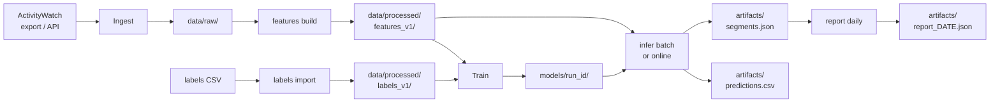

# Usage Guide

This guide walks through the main workflows for taskclf, from first
install through daily reports.

---

## Prerequisites

- **Python >= 3.14**
- **[uv](https://docs.astral.sh/uv/)** package manager
- **[ActivityWatch](https://activitywatch.net/)** (only needed for real
  data; the synthetic-data workflow works without it)

## Installation

```bash
uv sync
uv run taskclf --help
```

`uv sync` installs all dependencies into a local virtual environment.
`taskclf --help` prints the top-level command groups:

```text
ingest    Import raw activity data
features  Build per-minute feature rows
labels    Import / manage label spans
train     Train a classifier
infer     Run batch or online inference
report    Generate daily summaries
```

---

## Data flow

The diagram below shows how data moves through the pipeline.
Batch mode runs left-to-right once; online mode loops continuously on the
right-hand side.



---

## Use case 1 — End-to-end batch pipeline

This is the standard collect-train-predict-report workflow.

### Step 1: Ingest ActivityWatch data

```bash
uv run taskclf ingest aw --input /path/to/aw-export.json
```

Reads an ActivityWatch JSON export, normalizes app names to reverse-domain
identifiers, hashes window titles for privacy, and writes events to
`data/raw/aw/<YYYY-MM-DD>/events.parquet` partitioned by date.

If the export contains an `aw-watcher-input` bucket (type `os.hid.input`),
keyboard/mouse aggregate counts (key presses, clicks, mouse movement, scroll)
are also extracted and written to `data/raw/aw-input/<YYYY-MM-DD>/events.parquet`.
These input events are used to populate the `keys_per_min`, `clicks_per_min`,
`scroll_events_per_min`, and `mouse_distance` features during feature building.
The input watcher is optional -- if absent, those features remain null.

| Option | Default | Description |
|---|---|---|
| `--input` | *(required)* | Path to ActivityWatch JSON export |
| `--out-dir` | `data/raw/aw` | Output directory |
| `--title-salt` | `taskclf-default-salt` | Salt for title hashing |

### Step 2: Build features

```bash
uv run taskclf features build --date 2026-02-16
```

Converts raw events for a single date into per-minute (60 s bucket)
feature rows and writes them to
`data/processed/features_v1/date=2026-02-16/features.parquet`.

Repeat for every date you have data for.

| Option | Default | Description |
|---|---|---|
| `--date` | *(required)* | Date in `YYYY-MM-DD` format |
| `--data-dir` | `data/processed` | Processed data directory |

### Step 3: Import labels

```bash
uv run taskclf labels import --file data/interim/labels.csv
```

The CSV must have four columns:

| Column | Type | Example |
|---|---|---|
| `start_ts` | UTC datetime | `2026-02-16T09:00:00Z` |
| `end_ts` | UTC datetime | `2026-02-16T09:30:00Z` |
| `label` | string | `coding` |
| `provenance` | string | `manual` |

Valid labels (v1):

- `coding`
- `writing_docs`
- `messaging_email`
- `browsing_research`
- `meetings_calls`
- `break_idle`

| Option | Default | Description |
|---|---|---|
| `--file` | *(required)* | Path to labels CSV |
| `--data-dir` | `data/processed` | Processed data directory |

### Step 4: Train a model

```bash
uv run taskclf train lgbm --from 2026-02-01 --to 2026-02-16
```

Joins features and labels, splits by day (never random rows), trains a
LightGBM multiclass classifier, and saves a model bundle to
`models/<run_id>/`.

| Option | Default | Description |
|---|---|---|
| `--from` | *(required)* | Start date |
| `--to` | *(required)* | End date (inclusive) |
| `--synthetic` | `false` | Use dummy features + labels |
| `--models-dir` | `models` | Base directory for model bundles |
| `--data-dir` | `data/processed` | Processed data directory |
| `--num-boost-round` | `100` | LightGBM boosting rounds |

### Step 5: Run batch inference

```bash
uv run taskclf infer batch \
  --model-dir models/<run_id> \
  --from 2026-02-01 \
  --to 2026-02-16
```

Predicts a task label for every minute bucket, applies rolling-majority
smoothing, groups consecutive same-label buckets into segments, and writes
two output files.

| Option | Default | Description |
|---|---|---|
| `--model-dir` | *(required)* | Path to a model run directory |
| `--from` | *(required)* | Start date |
| `--to` | *(required)* | End date (inclusive) |
| `--synthetic` | `false` | Use dummy features |
| `--data-dir` | `data/processed` | Processed data directory |
| `--out-dir` | `artifacts` | Output directory |
| `--smooth-window` | `3` | Rolling majority window size |

### Step 6: Generate a report

```bash
uv run taskclf report daily --segments-file artifacts/segments.json
```

Produces a daily summary (total minutes, breakdown by task type) and saves
it to `artifacts/report_<date>.json`.

| Option | Default | Description |
|---|---|---|
| `--segments-file` | *(required)* | Path to `segments.json` |
| `--out-dir` | `artifacts` | Output directory |

---

## Use case 2 — Quick demo with synthetic data

No ActivityWatch export or labels file needed. The `--synthetic` flag
generates random features and labels so you can exercise the entire
pipeline.

```bash
# Train on synthetic data (7 days, 60 rows/day)
uv run taskclf train lgbm \
  --from 2026-02-01 --to 2026-02-07 \
  --synthetic

# Run inference on synthetic features using the model you just trained
uv run taskclf infer batch \
  --model-dir models/<run_id> \
  --from 2026-02-01 --to 2026-02-07 \
  --synthetic

# Generate a report from the resulting segments
uv run taskclf report daily --segments-file artifacts/segments.json
```

Replace `<run_id>` with the directory name printed by the train command.

---

## Use case 3 — Online (real-time) inference

Continuously polls a running ActivityWatch instance, builds feature rows
from live window events, predicts task types, smooths predictions, and
writes running outputs to `artifacts/`.  If `aw-watcher-input` is running,
keyboard/mouse stats are automatically included in predictions.

```bash
uv run taskclf infer online \
  --model-dir models/<run_id> \
  --poll-seconds 60 \
  --aw-host http://localhost:5600 \
  --smooth-window 5
```

Press **Ctrl+C** to stop; a final daily report is generated on shutdown.

| Option | Default | Description |
|---|---|---|
| `--model-dir` | *(required)* | Path to a model run directory |
| `--poll-seconds` | `60` | Seconds between polls |
| `--aw-host` | `http://localhost:5600` | ActivityWatch server URL |
| `--smooth-window` | `3` | Rolling majority window size |
| `--title-salt` | `taskclf-default-salt` | Salt for title hashing |
| `--out-dir` | `artifacts` | Output directory |

Online mode **never retrains** — it only uses the pre-trained model.

---

## Use case 4 — Re-label and retrain

When your labels change or you collect more data, import the updated
labels and train a fresh model. Each training run creates a new immutable
directory under `models/`, so previous models are never overwritten.

```bash
# Import updated labels
uv run taskclf labels import --file data/interim/labels_v2.csv

# Retrain over a wider date range
uv run taskclf train lgbm --from 2026-01-15 --to 2026-02-20

# Re-run inference with the new model
uv run taskclf infer batch \
  --model-dir models/<new_run_id> \
  --from 2026-01-15 --to 2026-02-20

# Generate report
uv run taskclf report daily --segments-file artifacts/segments.json
```

---

## Command reference

| Command | Purpose |
|---|---|
| `taskclf ingest aw` | Import an ActivityWatch JSON export into normalized, privacy-safe events |
| `taskclf features build` | Build per-minute feature rows for a single date |
| `taskclf labels import` | Import label spans from a CSV file |
| `taskclf train lgbm` | Train a LightGBM multiclass classifier |
| `taskclf infer batch` | Batch predict, smooth, and segmentize |
| `taskclf infer online` | Real-time poll-predict loop (requires running ActivityWatch) |
| `taskclf report daily` | Generate a daily summary from segments |

---

## Directory conventions

| Directory | Contents |
|---|---|
| `data/raw/aw/` | Normalized window events from AW exports (by date) |
| `data/raw/aw-input/` | Keyboard/mouse aggregate counts from `aw-watcher-input` (by date) |
| `data/processed/` | Versioned feature and label datasets |
| `models/` | Model bundles (one directory per training run, never overwritten) |
| `artifacts/` | Predictions, segments, reports, evaluation outputs |
