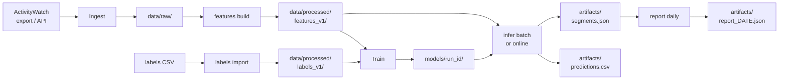

# Usage Guide

This guide walks through the main workflows for taskclf, from first
install through daily reports.

---

## Prerequisites

- **Python >= 3.14**
- **[uv](https://docs.astral.sh/uv/)** package manager
- **[ActivityWatch](https://activitywatch.net/)** (only needed for real
  data; the synthetic-data workflow works without it)

## Installation

### Development (local checkout)

```bash
uv sync
uv run taskclf --help
```

`uv sync` installs all dependencies into a local virtual environment.
`taskclf --help` prints the top-level command groups:

```text
ingest    Import raw activity data
features  Build per-minute feature rows
labels    Import / manage label spans
train     Train a classifier
infer     Run batch or online inference
report    Generate daily summaries
```

### Global install

```bash
uv tool install taskclf
taskclf --help
```

If you prefer pip and have Python ≥ 3.14:

```bash
pip install taskclf
taskclf --help
```

When installed globally, all data/model/artifact paths default to a
platform-specific home directory.  Override it with `TASKCLF_HOME`:

```bash
export TASKCLF_HOME=~/my-taskclf   # optional, customise the root
taskclf tray
```

| Priority | Source | Default |
|---|---|---|
| 1 | `TASKCLF_HOME` env var | *(user-defined)* |
| 2 | macOS | `~/Library/Application Support/taskclf/` |
| 3 | Linux (XDG) | `~/.local/share/taskclf/` |
| 4 | Windows | `%LOCALAPPDATA%/taskclf/` |

CLI options like `--data-dir` and `--models-dir` still override the
defaults when provided.

### Desktop app (Electron)

Prebuilt installers are published on
[GitHub Releases](https://github.com/fruitiecutiepie/taskclf/releases).
Look for assets attached to tags named `launcher-v*` (the desktop shell).
Payload zips for the downloaded backend are on separate tags `v*`, not on
`launcher-v*`.

| OS | What to download |
|----|------------------|
| Windows | `*.exe` (NSIS installer) |
| Linux | `*.AppImage` (make executable, then run) |
| macOS | `*.dmg` (open and drag **taskclf** to Applications) |

The app name in the menu bar is **taskclf**. The shell can download and run
Python backend payloads published alongside version tags `v*`. Those payloads are
**PyInstaller one-folder** bundles (`backend/entry` or `backend/entry.exe` inside
`payload-<triple>.zip`); see [`electron_shell`](../api/ui/electron_shell.md) and
[`payload_build`](../api/scripts/payload_build.md) for how the shell talks to the
CLI backend and how release zips are built.

On packaged startup, the launcher now shows a small native **status** window
immediately while it checks for the local core and waits for the local UI
backend. On **first launch** (or when you choose **Update and Restart** after an
update prompt), that startup flow can switch into a **download progress**
window: it shows download percentage when the size is known, then verifying and
extracting messages while the payload is prepared. When more than one
compatible payload exists, **Initial Setup** / **Core Update Required** and
**Core Update Available** dialogs can also offer **Choose Version** to pick a
specific payload for that step (without changing the tray **Selected** pin; see
[`electron_shell`](../api/ui/electron_shell.md)).

Packaged builds also expose **Check for Updates** in the tray menu. That action
checks the latest compatible payload on demand, shows **Up to Date** when the
active payload is current, and otherwise offers **Update and Restart** (plus
**Choose Version** when multiple compatible payloads exist).

---

## Data flow

The diagram below shows how data moves through the pipeline.
Batch mode runs left-to-right once; online mode loops continuously on the
right-hand side.


```mermaid
flowchart LR
    AW["ActivityWatch\nexport / API"] --> Ingest
    Ingest --> RawEvents["data/raw/"]
    RawEvents --> Features["features build"]
    Features --> FeaturesDir["data/processed/\nfeatures_v1/"]
    LabelsCSV["labels CSV"] --> LabelsImport["labels import"]
    LabelsImport --> LabelsDir["data/processed/\nlabels_v1/"]
    FeaturesDir --> Train
    LabelsDir --> Train
    Train --> ModelBundle["models/run_id/"]
    ModelBundle --> Infer["infer batch\nor online"]
    FeaturesDir --> Infer
    Infer --> Predictions["artifacts/\npredictions.csv"]
    Infer --> Segments["artifacts/\nsegments.json"]
    Segments --> Report["report daily"]
    Report --> ReportFile["artifacts/\nreport_DATE.json"]
```

---

## Use case 1 — End-to-end batch pipeline

This is the standard collect-train-predict-report workflow.

### Step 1: Ingest ActivityWatch data

```bash
uv run taskclf ingest aw --input /path/to/aw-export.json
```

Reads an ActivityWatch JSON export, normalizes app names to reverse-domain
identifiers, hashes window titles for privacy, and writes events to
`data/raw/aw/<YYYY-MM-DD>/events.parquet` partitioned by date.

If the export contains an `aw-watcher-input` bucket (type `os.hid.input`),
keyboard/mouse aggregate counts (key presses, clicks, mouse movement, scroll)
are also extracted and written to `data/raw/aw-input/<YYYY-MM-DD>/events.parquet`.
These input events are used to populate the `keys_per_min`, `clicks_per_min`,
`scroll_events_per_min`, and `mouse_distance` features during feature building.
The input watcher is optional -- if absent, those features remain null.

| Option | Default | Description |
|---|---|---|
| `--input` | *(required)* | Path to ActivityWatch JSON export |
| `--out-dir` | `data/raw/aw` | Output directory |
| `--title-salt` | `taskclf-default-salt` | Salt for title hashing |

### Step 2: Build features

```bash
uv run taskclf features build --date 2026-02-16
```

Converts raw events for a single date into per-minute (60 s bucket)
feature rows and writes them to
`data/processed/features_v1/date=2026-02-16/features.parquet`.

Repeat for every date you have data for.

| Option | Default | Description |
|---|---|---|
| `--date` | *(required)* | Date in `YYYY-MM-DD` format |
| `--data-dir` | `data/processed` | Processed data directory |

### Step 3: Import labels

```bash
uv run taskclf labels import --file data/interim/labels.csv
```

The CSV must have four columns:

| Column | Type | Example |
|---|---|---|
| `start_ts` | UTC datetime | `2026-02-16T09:00:00Z` |
| `end_ts` | UTC datetime | `2026-02-16T09:30:00Z` |
| `label` | string | `coding` |
| `provenance` | string | `manual` |

Valid labels (v1) — see [Task Ontology](labels_v1.md) for full definitions:

- `Build`
- `Debug`
- `Review`
- `Write`
- `ReadResearch`
- `Communicate`
- `Meet`
- `BreakIdle`

| Option | Default | Description |
|---|---|---|
| `--file` | *(required)* | Path to labels CSV |
| `--data-dir` | `data/processed` | Processed data directory |

#### Real-time labeling

If you have ActivityWatch running and want to label as you work, use
`label-now` instead of writing timestamps by hand:

```bash
uv run taskclf labels label-now --minutes 10 --label Build
```

This labels the last 10 minutes, querying ActivityWatch for a live
summary of which apps were active in that window.

| Option | Default | Description |
|---|---|---|
| `--minutes` | `10` | How many minutes back to label |
| `--label` | *(required)* | Core label |
| `--user-id` | `default-user` | User identifier |
| `--confidence` | *(none)* | Labeler confidence (0-1) |
| `--aw-host` | `http://localhost:5600` | ActivityWatch server URL |

You can also label in the **web UI** via the "Recent" tab:

```bash
uv run taskclf ui
```

This launches a local web server at `http://127.0.0.1:8741` with a
SolidJS frontend for labeling, queue management, and live prediction
streaming.

For frontend development with hot module replacement, add `--dev`:

```bash
uv run taskclf ui --dev
```

This starts the Vite dev server on `http://127.0.0.1:5173` alongside
the API backend. Edit `.tsx` files and see changes instantly.

For browser-based full-stack development, use:

```bash
uv run taskclf ui --dev --browser
```

This keeps Vite HMR for the frontend and also runs the FastAPI backend
with auto-reload, so Python changes under `src/taskclf/` restart the
server without restarting the dev session.

In `--dev` mode, an ephemeral data directory is created automatically
and cleaned up on exit, so your production data is never touched.
To use a specific directory instead, pass `--data-dir`:

```bash
uv run taskclf ui --dev --data-dir data/dev
```

### Step 4: Train a model

```bash
uv run taskclf train lgbm --from 2026-02-01 --to 2026-02-16
```

Joins features and labels, splits by day (never random rows), trains a
LightGBM multiclass classifier, and saves a model bundle to
`models/<run_id>/`.

| Option | Default | Description |
|---|---|---|
| `--from` | *(required)* | Start date |
| `--to` | *(required)* | End date (inclusive) |
| `--synthetic` | `false` | Use dummy features + labels |
| `--models-dir` | `models` | Base directory for model bundles |
| `--data-dir` | `data/processed` | Processed data directory |
| `--num-boost-round` | `100` | LightGBM boosting rounds |

### Inspect a trained bundle

See validation metrics stored in the bundle and (optionally) replay held-out
test evaluation and class distribution:

```bash
uv run taskclf model inspect --model-dir models/<run_id>
uv run taskclf model inspect --model-dir models/<run_id> --json
uv run taskclf model inspect --model-dir models/<run_id> \
  --from 2026-02-01 --to 2026-02-16 --data-dir data/processed
```

See [CLI model inspect](../api/cli/main.md#model-inspect) and
[Model Inspection API](../api/model_inspection.md).

Bundle-only output summarizes validation metrics from `metrics.json` (support,
confusions, top mistake pairs).  Adding `--from` / `--to` (and optional
`--synthetic`) replays test evaluation and surfaces richer quality signals
(calibration, slices, unseen categorical exposure) in the same shape as
`evaluation.json` from `taskclf train evaluate`.

### Step 5: Run batch inference

```bash
uv run taskclf infer batch \
  --model-dir models/<run_id> \
  --from 2026-02-01 \
  --to 2026-02-16
```

Predicts a task label for every minute bucket, applies rolling-majority
smoothing, groups consecutive same-label buckets into segments, and writes
two output files.

| Option | Default | Description |
|---|---|---|
| `--model-dir` | *(required)* | Path to a model run directory |
| `--from` | *(required)* | Start date |
| `--to` | *(required)* | End date (inclusive) |
| `--synthetic` | `false` | Use dummy features |
| `--data-dir` | `data/processed` | Processed data directory |
| `--out-dir` | `artifacts` | Output directory |
| `--smooth-window` | `3` | Rolling majority window size |

### Step 6: Generate a report

```bash
uv run taskclf report daily --segments-file artifacts/segments.json
```

Produces a daily summary (total minutes, breakdown by task type) and saves
it to `artifacts/report_<date>.json`.

| Option | Default | Description |
|---|---|---|
| `--segments-file` | *(required)* | Path to `segments.json` |
| `--out-dir` | `artifacts` | Output directory |

---

## Use case 2 — Quick demo with synthetic data

No ActivityWatch export or labels file needed. The `--synthetic` flag
generates random features and labels so you can exercise the entire
pipeline.

```bash
# Train on synthetic data (7 days, 60 rows/day)
uv run taskclf train lgbm \
  --from 2026-02-01 --to 2026-02-07 \
  --synthetic

# Run inference on synthetic features using the model you just trained
uv run taskclf infer batch \
  --model-dir models/<run_id> \
  --from 2026-02-01 --to 2026-02-07 \
  --synthetic

# Generate a report from the resulting segments
uv run taskclf report daily --segments-file artifacts/segments.json
```

Replace `<run_id>` with the directory name printed by the train command.

---

## Use case 3 — Online (real-time) inference

Continuously polls a running ActivityWatch instance, builds feature rows
from live window events, predicts task types, smooths predictions, and
writes running outputs to `artifacts/`.  If `aw-watcher-input` is running,
keyboard/mouse stats are automatically included in predictions.

```bash
uv run taskclf infer online \
  --model-dir models/<run_id> \
  --poll-seconds 60 \
  --aw-host http://localhost:5600 \
  --smooth-window 5
```

Press **Ctrl+C** to stop; a final daily report is generated on shutdown.

| Option | Default | Description |
|---|---|---|
| `--model-dir` | *(required)* | Path to a model run directory |
| `--poll-seconds` | `60` | Seconds between polls |
| `--aw-host` | `http://localhost:5600` | ActivityWatch server URL |
| `--smooth-window` | `3` | Rolling majority window size |
| `--title-salt` | `taskclf-default-salt` | Salt for title hashing |
| `--out-dir` | `artifacts` | Output directory |
| `--label-queue` | off | Auto-enqueue low-confidence predictions for manual labeling |
| `--label-confidence` | `0.55` | Confidence threshold for auto-enqueue |

When `--label-queue` is enabled, uncertain predictions are added to the
labeling queue (`data/processed/labels_v1/queue.json`) and surface in
`taskclf labels show-queue` and the web UI for review.

Online mode **never retrains** — it only uses the pre-trained model.

---

## Use case 4 — Re-label and retrain

When your labels change or you collect more data, import the updated
labels and train a fresh model. Each training run creates a new immutable
directory under `models/`, so previous models are never overwritten.

```bash
# Import updated labels
uv run taskclf labels import --file data/interim/labels_v2.csv

# Retrain over a wider date range
uv run taskclf train lgbm --from 2026-01-15 --to 2026-02-20

# Re-run inference with the new model
uv run taskclf infer batch \
  --model-dir models/<new_run_id> \
  --from 2026-01-15 --to 2026-02-20

# Generate report
uv run taskclf report daily --segments-file artifacts/segments.json
```

---

## Use case 5 — Continuous labeling with the system tray app

For hands-free labeling as you work, run the system tray app.  It sits
in your taskbar/menubar, polls ActivityWatch, and prompts you to label
when it detects a significant change in your foreground application.
The web UI server starts automatically so the "Show/Hide Window" menu
item opens the labeling dashboard in a browser.

```bash
uv run taskclf tray
```

Without a model, all 8 core labels are shown when a transition is
detected.  With a trained model, the app suggests the most likely label.
The dashboard now comes up before the model bundle finishes warming, so
suggestions may appear a moment after the UI is reachable on a cold
start:

```bash
uv run taskclf tray --model-dir models/<run_id>
```

| Option | Default | Description |
|---|---|---|
| `--model-dir` | *(none)* | Model bundle for label suggestions |
| `--aw-host` | `http://localhost:5600` | ActivityWatch server URL |
| `--poll-seconds` | `60` | Seconds between polls |
| `--transition-minutes` | `3` | Minutes a new app must persist before prompting |
| `--data-dir` | `data/processed` (ephemeral in `--dev`) | Processed data directory; omit with `--dev` for an auto-cleaned temp dir |
| `--port` | `8741` | Port for the embedded web UI server |
| `--dev` | off | Vite hot reload + ephemeral data dir (unless `--data-dir` is set) |

You can also label at any time by right-clicking the tray icon and
choosing "Label Last N min" with a label from the submenu.

---

## Command reference

| Command | Purpose |
|---|---|
| `taskclf ingest aw` | Import an ActivityWatch JSON export into normalized, privacy-safe events |
| `taskclf features build` | Build per-minute feature rows for a single date |
| `taskclf labels import` | Import label spans from a CSV file |
| `taskclf labels add-block` | Create a manual label block for a time range |
| `taskclf labels label-now` | Label the last N minutes (queries AW for live summary) |
| `taskclf labels show-queue` | Show pending labeling requests |
| `taskclf labels export` | Export labels.parquet to CSV |
| `taskclf train lgbm` | Train a LightGBM multiclass classifier |
| `taskclf infer batch` | Batch predict, smooth, and segmentize |
| `taskclf infer online` | Real-time poll-predict loop (supports `--label-queue`) |
| `taskclf report daily` | Generate a daily summary from segments |
| `taskclf tray` | System tray labeling app with activity transition detection |

---

## Directory conventions

All paths below are relative to `TASKCLF_HOME` (see
[Installation](#installation) for resolution order).

| Directory | Contents |
|---|---|
| `data/raw/aw/` | Normalized window events from AW exports (by date) |
| `data/raw/aw-input/` | Keyboard/mouse aggregate counts from `aw-watcher-input` (by date) |
| `data/processed/` | Versioned feature and label datasets |
| `models/` | Model bundles (one directory per training run, never overwritten) |
| `artifacts/` | Predictions, segments, reports, evaluation outputs |
| `artifacts/telemetry/` | Drift and telemetry data |
| `configs/` | Configuration files (e.g. `retrain.yaml`) |
